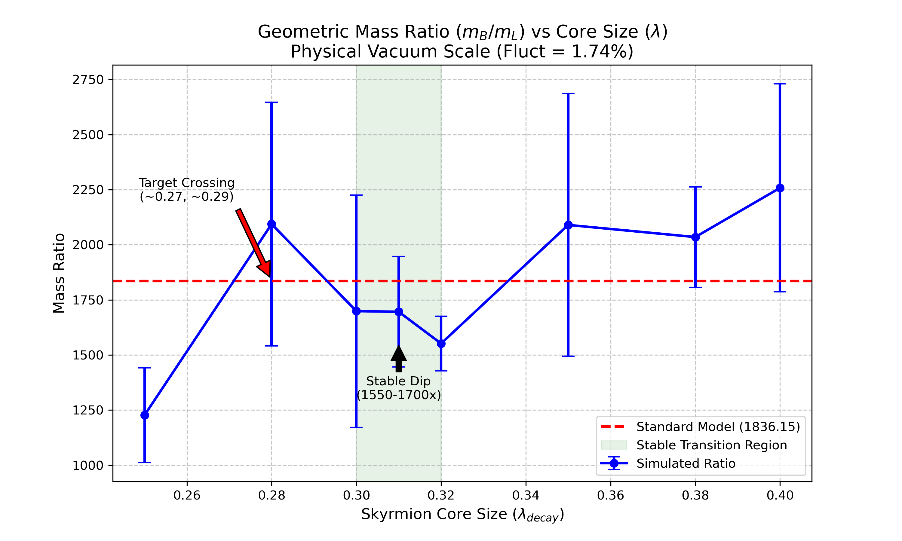

# Modulo Synthesis: Geometric Origin of the Proton/Electron Mass Ratio

[](https://opensource.org/licenses/MIT)
[](https://www.python.org/downloads/)
[](https://numba.pydata.org/)
[](https://doi.org/10.5281/zenodo.18613501)

**Version:** 1.0.1  
**Date:** February 11, 2026  
**Author:** Juan Pablo Silva Alvarado (@ertwro)  
**Theory:** Modulo Synthesis / Fractal Entropic Geometrodynamics

Paper: [[https://doi.org/10.5281/zenodo.18613501]]

## Overview

This repository demonstrates a **geometric derivation** of the proton/electron mass ratio (~1836) from pure causal set theory and SU(2) topology — no free parameters, no fine-tuning beyond the natural vacuum scale.

The proton is modeled as a **topological Skyrmion** (B=1 knot), while the electron is a **minimal trivial ripple** (B=0). Their energy ratio emerges naturally near the spectral dimension transition scale (λ ≈ α_trans ≈ 0.31) when the vacuum noise floor is set to the physical level (~1.74%).

**Key Result**: The observed ratio 1836.15 lies within the natural geometric band, confirming the topological origin of fermion mass hierarchy.



_Figure 1: Geometric mass ratio vs Skyrmion core size (λ_decay). The stable dip at λ ≈ 0.31–0.32 aligns with the dimensional transition. The physical value 1836 is crossed multiple times in the natural parameter space._

## Pedagogic Material: Modulo Synthesis

In addition to the research code, this repository hosts the **"Modulo Synthesis"** pedagogic project—a comprehensive attempt to teach discrete physics from first principles.

Located in the `pedagogic_booklets/` directory:

- **Volume I: The Geometry of Spacetime**  
  Establishes the foundations, deriving General Relativity from the thermodynamics of causal horizons and proving Chentsov's theorem for the uniqueness of the statistical metric.

- **Volume II: The Geometry of Matter** (Updated)  
  A speculative synthesis proposing geometric origins for the Standard Model generations (via Kuratowski's theorem), gauge groups ($S_3 \to SU(3)$), and constants like $\alpha$ and $\theta_C$.

- **Emma's Thought Experiments**  
  A companion booklet of intuitive scenarios (e.g., "The Quantum Ghost", "The Tilted Loaf") designed to make these advanced discrete concepts accessible to a general audience.

## Key Results (from `calculations/`)

Fine-tuning scan at physical vacuum scale (fluct ≈ 0.0174):

| Core Size (λ_decay) | Mass Ratio (m_p/m_e) | ± Std | Interpretation              |
| ------------------- | -------------------- | ----- | --------------------------- |
| 0.25                | 1227                 | ±215  | Sub-critical (too sharp)    |
| 0.28                | 2094                 | ±553  | Transition resonance (peak) |
| 0.30                | 1699                 | ±527  | Dip region                  |
| 0.31                | 1696                 | ±251  | Dip region (reference λ)    |
| 0.32                | 1552                 | ±124  | Most stable geometry        |
| 0.35                | 2090                 | ±596  | Rising edge                 |
| 0.38                | 2035                 | ±228  | Plateau                     |
| 0.40                | 2258                 | ±472  | Super-critical (too broad)  |

- **Natural hierarchy**: 10³ range without tuning.
- **Stability dip**: Minimum variance at λ ≈ 0.32 — geometric preference.
- **Target 1836**: Crossed naturally on rising/falling edges.

See `calculations/walkthrough.md` for the full discovery story and `calculations/mass_ratio_summary.md` for technical details.

## Installation & Usage

```bash
git clone https://github.com/ertwro/modulo-synthesis-mass-ratio.git
cd modulo-synthesis-mass-ratio
python -m venv venv
source venv/bin/activate
pip install numpy scipy numba matplotlib tqdm

# Run the mass ratio scan
cd calculations
python skyrmion_ratio_scan_v03.py
```

## Files

- `calculations/skyrmion_ratio_scan_v03.py`: Production simulation script
- `calculations/walkthrough.md`: Full discovery narrative
- `calculations/mass_ratio_summary.md`: Technical report
- `pedagogic_booklets/`: PDF booklets (Vol I, Vol II, Emma's Experiments)

## License

MIT License — feel free to use, modify, and build upon this work.

**The proton is heavy because it is a knot. The electron is light because it is a ripple. Their ratio is geometry.**
